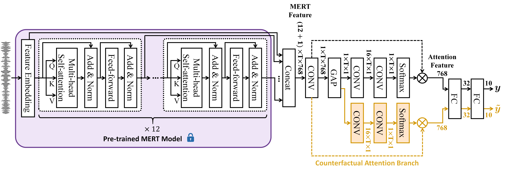
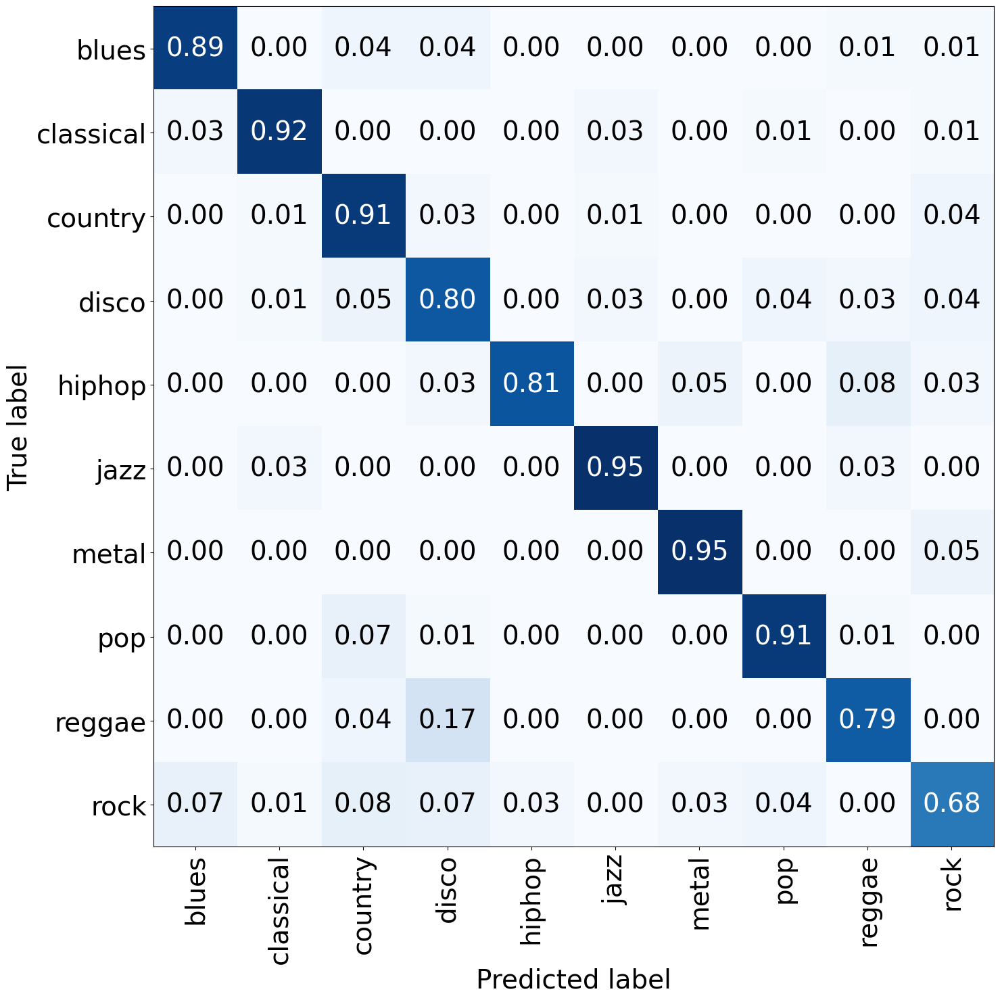
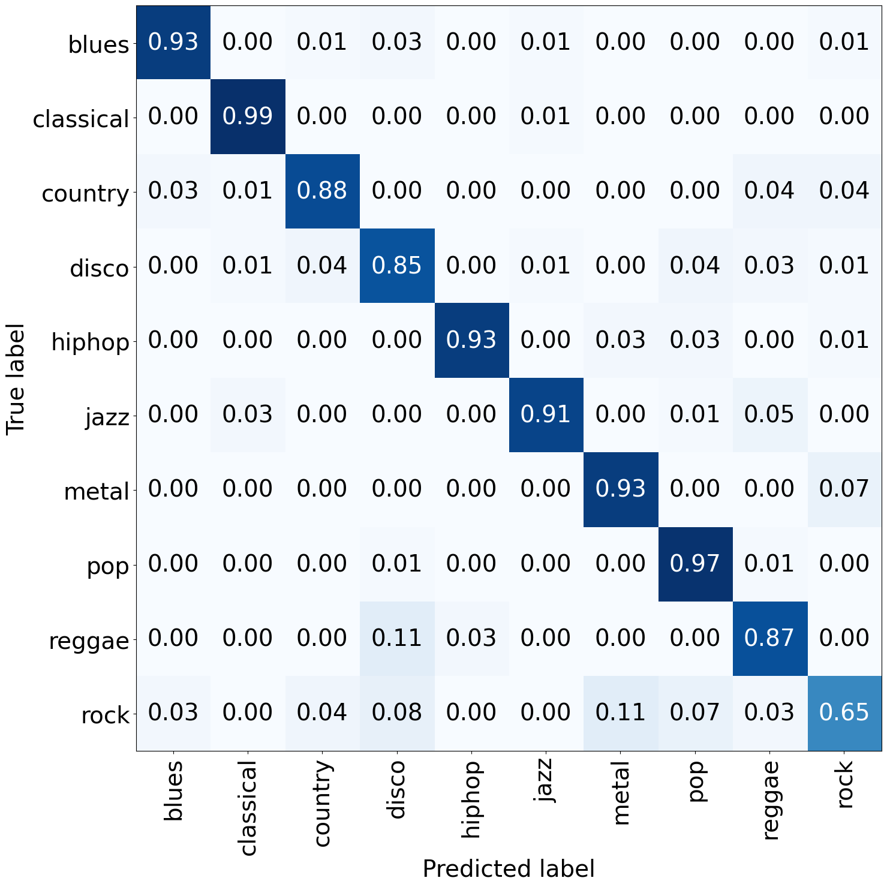

# Learnable Counterfactual Attention for Music Classification



<p align="center"> Proposed genreMERT (with LCA) architecture. </p>

## Introduction

This repo is official PyTorch implementation of **Learnable Counterfactual Attention for Music Classification (TASLP 2025)**.

We introduced a **learnable counterfactual attention (LCA)** mechanism, a new counterfactual attention learning approach, to guide the attention-based deep-net model in focusing attention on more discriminative regions to learn the task-specific features to help identify fine-grained sounds.

Pleaser refer to our **[paper](https://ieeexplore.ieee.org/document/10833812)** for further details.


## Getting started 

#### Installation & Clone the repo [Environment on Linux (Ubuntu 22.04 with python >= 3.8)]

```bash
# Clone the repo:
$ git clone https://github.com/koso019003/Learnable-Counterfactual-Attention.git
$ cd $PWD/Learnable-Counterfactual-Attention

# Install the requirements using `conda` and `pip`: 
$ conda create -y -n genreMERT python=3.8
$ conda activate genreMERT
$ conda install -y pytorch=2.2.1 torchaudio=2.2.1 pytorch-cuda=11.8 -c pytorch -c nvidia
$ conda install -y lightning=2.2.0.post0 -c conda-forge

$ pip install -r requirements.txt

```

## Download weights 

Download the pre-trained genreMERT and genreMERT (w/ LCA) weights from [here](https://drive.google.com/drive/folders/1jhH_GB1I0g_n1bWcFjSV0TQiZmZNZ1-S?usp=sharing).

You need to unzip the contents, and the data directory structure should follow the hierarchy below.

```
${ROOT}  
|-- weights  
|   |-- genreMERT_LCA.ckpt
|   |-- genreMERT.ckpt
```

## Evaluation

Run the commands below under the folder src/ to evaluate a pretrained model on GTZAN test set.

You should be able to obtain the output below, which is identical to the result in Table V (see our paper):

```bash
$ cd src

# genreMERT
$ CUDA_VISIBLE_DEVICES=0 python main.py --exp genreMERT
Seed set to 0
Loading dataset...
Setting sample rate from 22050 to 24000
GPU available: True (cuda), used: True
TPU available: False, using: 0 TPU cores
IPU available: False, using: 0 IPUs
HPU available: False, using: 0 HPUs
Predicting test_dataset result
LOCAL_RANK: 0 - CUDA_VISIBLE_DEVICES: [0]
Predicting DataLoader 0: 100%|████████████████████████████████████| 47/47 [00:11<00:00,  4.24it/s]

Number of parameters: 94.40 (M)
Test accuracy:
Frame level: 0.86       Song level: 0.88
```

```bash
$ cd src

# genreMERT (w/ LCA)
$ CUDA_VISIBLE_DEVICES=0 python main.py --exp genreMERT_LCA
Seed set to 0
Loading dataset...
Setting sample rate from 22050 to 24000
GPU available: True (cuda), used: True
TPU available: False, using: 0 TPU cores
IPU available: False, using: 0 IPUs
HPU available: False, using: 0 HPUs
Predicting test_dataset result
LOCAL_RANK: 0 - CUDA_VISIBLE_DEVICES: [0]
Predicting DataLoader 0: 100%|████████████████████████████████████| 47/47 [00:10<00:00,  4.30it/s]

Number of parameters: 94.40 (M)
Test accuracy:
Frame level: 0.89       Song level: 0.92
```

You should also be able to obtain the results under the ROOT/result.

### Results

| Models             | Frame Level Acc. | Song Level Acc. | #Para. (M) |
|--------------------|------------------|-----------------|------------|
| genreMERT          | 0.86             | 0.88            | 94.40      |
| genreMERT (w/ LCA) | 0.89             | 0.92            | 94.40      |

### Confusion matrix

|      genreMERT     | genreMERT (w/ LCA) |
|--------------------|--------------------|
|  |  |

## Citation

```bibtex
@ARTICLE{YiXing2025TASLP,
  author={Yi-Xing Lin, Jen-Chun Lin, Wen-Li Wei, and Jia-Ching Wang},
  journal={IEEE Transactions on Audio, Speech and Language Processing}, 
  title={Learnable Counterfactual Attention for Music Classification}, 
  year={2025},
  volume={},
  number={},
  pages={1-16},
  keywords={Counterfactual attention learning; Singer identification; Musical genre classification; Music classification},
  doi={10.1109/TASLPRO.2025.3527143}}
```

## License
This project is licensed under the terms of the MIT license.

## References
This code is partly based on [huggingface/transformers](https://github.com/huggingface/transformers).

The pre-trained weights of MERT used in genreMERT and genreMERT (w/ LCA) are from [here](https://huggingface.co/m-a-p/MERT-v1-95M).
